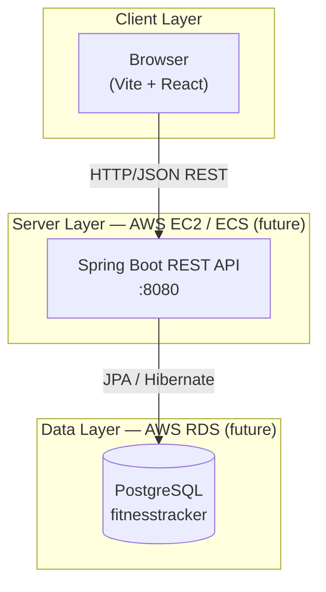
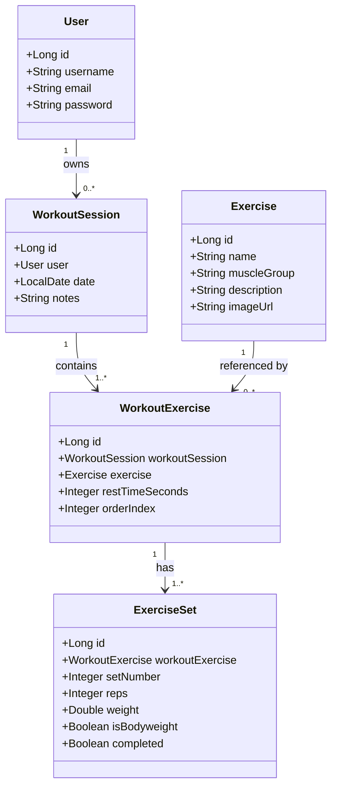
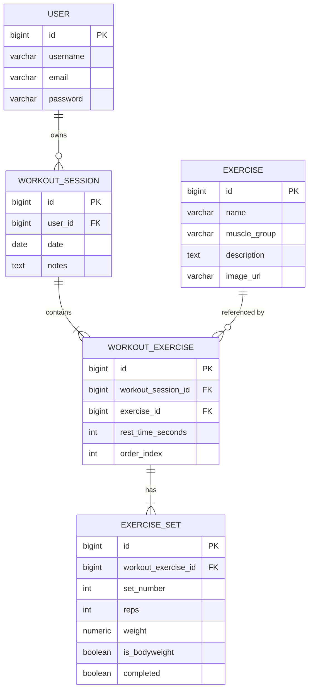
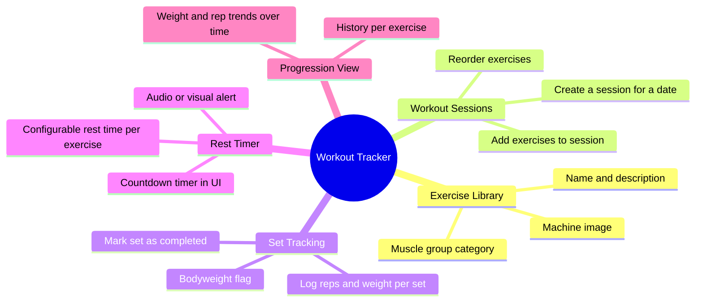
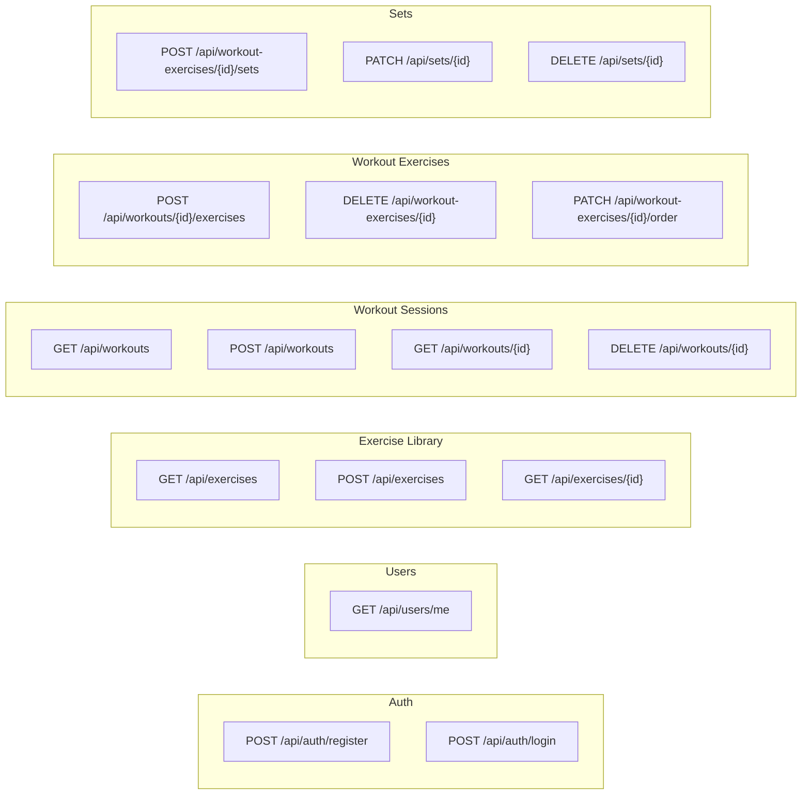
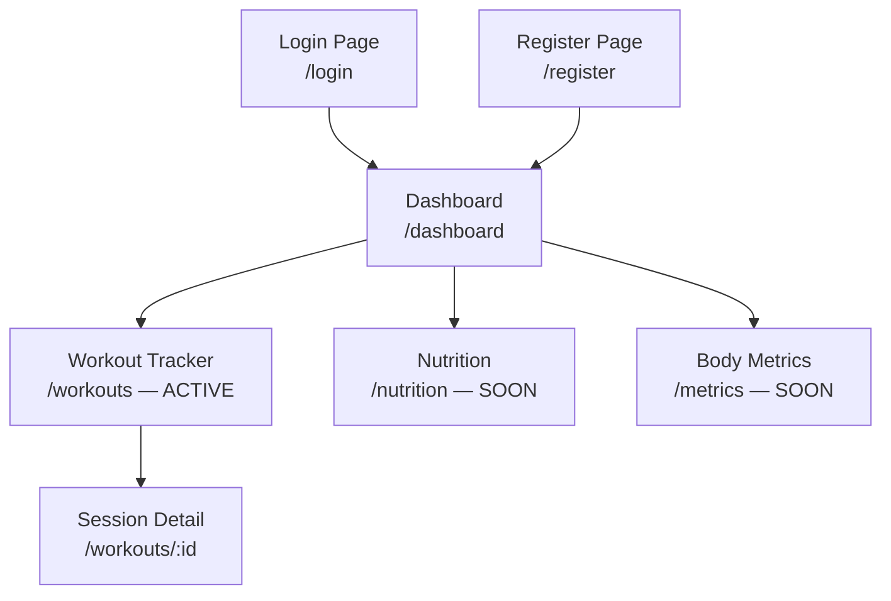
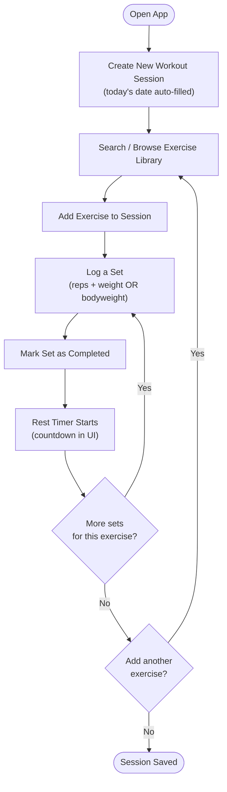
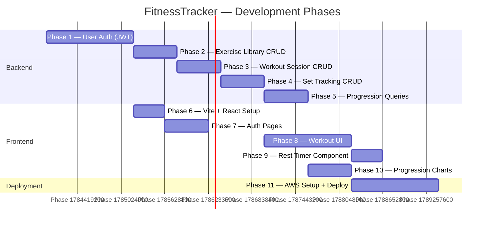

# FitnessTracker — Project Methodology

This document defines the vision, architecture, data model, feature scope, and development roadmap for the FitnessTracker application. It exists to prevent scope drift, keep design decisions documented, and serve as a shared reference throughout development.

---

## 1. Project Vision

A **multi-user fitness tracking web application** where each user can log and monitor their workouts over time. The application is built as a learning project with a real production target: deployment on AWS.

The interface is structured around activity domains (Workouts, Nutrition, Body Metrics) but **only the Workout domain is actively implemented**. Other sections exist in the navigation as "coming soon" placeholders.

---

## 2. Tech Stack

| Layer | Technology | Status |
|---|---|---|
| Backend | Spring Boot 4.1.0 / Java 25 / Maven | In progress |
| Database | PostgreSQL 16 | In progress |
| Frontend | Vite + React (TypeScript) | Not started |
| Authentication | TBD (JWT likely) | Not started |
| Deployment | AWS | Future goal |

The project is organized as two independent sub-projects:

```
FitnessTrackerProject/
├── backend/    ← Spring Boot (Maven)
└── frontend/   ← Vite + React (not yet created)
```

---

## 3. High-Level System Architecture



**Key principle:** The frontend and backend are completely decoupled. The frontend is a pure React SPA that communicates with the backend exclusively through REST API calls. No server-side rendering.

---

## 4. Data Model

### 4.1 Entity Overview

The workout domain is built around five core entities:

| Entity | Role |
|---|---|
| `User` | An account. Owns all data. |
| `WorkoutSession` | A single training day — e.g. "Monday July 14". Belongs to one User. |
| `Exercise` | A global template — "Bench Press", "Pull-up". Has an image and muscle group. Shared across all users. |
| `WorkoutExercise` | The bridge: "I did Bench Press during my Monday session". Holds ordering and rest time config. |
| `ExerciseSet` | A single set within a WorkoutExercise — reps, weight, completion status. |

### 4.2 Class Diagram



### 4.3 Entity Relationship Diagram



### 4.4 Set Model — Weighted vs Bodyweight

`ExerciseSet` supports both tracking styles using two fields together:

| Scenario | `weight` | `isBodyweight` |
|---|---|---|
| Weighted (e.g. Bench Press 80kg) | `80.0` | `false` |
| Pure bodyweight (e.g. Pull-up) | `null` | `true` |
| Weighted bodyweight (e.g. weighted dip +20kg) | `20.0` | `true` |

`weight` is nullable (`Double`, not `double`) — this is intentional and must be respected in validation logic.

---

## 5. Feature Scope

### 5.1 Workout Domain — In Scope



### 5.2 Navigation Domains — Out of Scope Now

These sections appear in the navigation but are not implemented. They exist only as visual placeholders.

| Domain | Status |
|---|---|
| Workouts | **Active** |
| Nutrition | Coming soon |
| Body Metrics | Coming soon |
| Sleep | Coming soon |

---

## 6. Planned REST API

All endpoints are prefixed `/api`. Authentication headers (once implemented) will be required on all routes except registration and login.



---

## 7. Frontend Structure

### 7.1 Page Navigation Flow



### 7.2 Workout Session User Flow

This describes what a user does during a typical training session:



---

## 8. Development Roadmap



### Phase Descriptions

| Phase | Goal | Key Deliverable |
|---|---|---|
| 1 | User Auth | JWT login/register, Spring Security filter chain |
| 2 | Exercise Library | Exercise CRUD with image URL, muscle group |
| 3 | Workout Sessions | Create/list/delete sessions scoped to logged-in user |
| 4 | Set Tracking | Full CRUD for WorkoutExercise + ExerciseSet |
| 5 | Progression | Queries returning history per exercise for a user |
| 6 | Frontend Bootstrap | Vite + React project, routing, API client setup |
| 7 | Auth UI | Login and register pages wired to backend |
| 8 | Workout UI | Full workout tracking page |
| 9 | Rest Timer | Frontend-only countdown component |
| 10 | Charts | Progression visualization (weight/reps over time) |
| 11 | AWS | EC2/ECS + RDS deployment, environment config |

---

## 9. Architecture Decisions Log

| Decision | Choice | Reason |
|---|---|---|
| Frontend/backend coupling | Fully decoupled (REST) | Enables independent deployment on AWS; cleaner separation of concerns |
| Set model | Single entity with `isBodyweight` flag + nullable `weight` | Avoids a separate table for a minor variant; simpler queries |
| Exercise images | `imageUrl` string on `Exercise` | Images are stored externally (S3 in future); DB stores only the reference |
| Schema management | Hibernate `ddl-auto=update` | Sufficient for development; will migrate to Flyway or Liquibase before AWS deployment |
| Auth | Not yet decided | Deliberately deferred — one phase at a time |

### Auth process

```mermaid
sequenceDiagram
    actor Client
    participant AuthController
    participant AuthService
    participant UserService
    participant JwtUtils
    participant DB

    Client->>AuthController: POST /api/auth/login {email, password}
    AuthController->>AuthService: login(LoginRequest)
    AuthService->>DB: find user by email
    DB-->>AuthService: User
    AuthService->>AuthService: verify password hash
    AuthService->>JwtUtils: generateToken(email)
    JwtUtils-->>AuthService: JWT string
    AuthService-->>AuthController: AuthResponse(token)
    AuthController-->>Client: 200 OK {token: "eyJ..."}

    Client->>JwtAuthFilter: GET /api/workouts\nAuthorization: Bearer eyJ...
    JwtAuthFilter->>JwtUtils: validateToken(token)
    JwtUtils-->>JwtAuthFilter: email = "stefan@..."
    JwtAuthFilter->>DB: load user by email
    JwtAuthFilter->>SecurityContext: set authenticated user
    JwtAuthFilter->>WorkoutController: request passes through
    WorkoutController-->>Client: 200 OK [workouts]